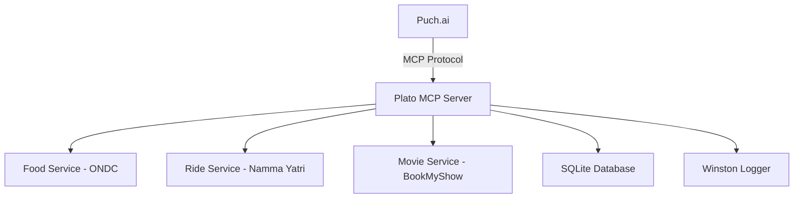

# 🚀 Plato MCP Server - Multi-Service Booking Platform

A unified booking platform that integrates **food ordering** (ONDC), **ride booking** (Namma Yatri), and **movie booking** (BookMyShow) through a single API, built for the **Puch.ai Hackathon**.

## ✨ Features

- 🍕 **Food Ordering**: ONDC integration with Ed25519 digital signatures
- 🚗 **Ride Booking**: Namma Yatri/Beckn protocol integration  
- 🎬 **Movie Booking**: BookMyShow web scraping with rate limiting
- 🔐 **MCP Authentication**: Bearer token validation for Puch.ai
- 📊 **Unified API**: Single interface for all three services
- ⚡ **Rate Limiting**: Built-in request throttling and delays
- 📝 **Comprehensive Logging**: Winston-based logging with metrics

## 🎯 Hackathon Demo

### Live Demo
- **Server URL**: `https://puch-hackathon-suzy.vercel.app/`
- **Status**: ✅ Live and functional

### Connect to Puch.ai
```bash
/mcp connect https://your-deployment.vercel.app hackathon_test_token_2024
```

### Test Commands
Try these natural language queries in Puch.ai:
- *"Find South Indian restaurants in Bangalore under 300 rupees"*
- *"Get ride estimates from MG Road to Koramangala"*
- *"Show me movies playing in Bangalore today"*

## 🏗️ Architecture



## 🛠️ Tech Stack

- **Backend**: Express.js + TypeScript
- **Database**: SQLite with Prisma ORM
- **Authentication**: Ed25519 signatures (ONDC) + Bearer tokens (MCP)
- **Logging**: Winston with file and console output
- **Deployment**: Vercel serverless functions
- **Protocol**: Model Context Protocol (MCP) for Puch.ai

## 📋 Available Tools

| Tool | Description | Example Usage |
|------|-------------|---------------|
| `order_food` | Search restaurants, view menus, get recommendations | Find vegetarian food in Bangalore |
| `book_ride` | Get ride estimates, book vehicles | Auto from MG Road to Airport |
| `book_movie` | Search movies, find showtimes, cinema info | Movies playing today in PVR |
| `validate` | MCP authentication (internal) | Used by Puch.ai for connection |

## 🚀 Quick Start

### Prerequisites
- Node.js 18.0.0+
- npm or yarn

### Installation
```bash
git clone https://github.com/chiragdamodar/puch_hackathon.git
cd plato-mcp-server
npm install
```

### Environment Setup
Configure these environment variables:
```bash
DATABASE_URL=file:./dev.db
ONDC_API_KEY=sandbox_test_key
MCP_BEARER_TOKEN=hackathon_test_token_2024
MCP_VALIDATE_PHONE_NUMBER=919141055471
# ... see .env.example for full list
```

### Database Setup
```bash
npm run db:generate
npm run db:push
```

### Development
```bash
npm run dev
# Server runs on http://localhost:3001
```

### Production Build
```bash
npm run build
npm start
```

## 📡 API Endpoints

### Health Check
```bash
GET /health
# Returns: {"status": "healthy"}
```

### List Tools
```bash
GET /tools
# Returns: Array of available MCP tools
```

### Food Ordering
```bash
POST /tools/order_food
Content-Type: application/json

{
  "location": "Bangalore",
  "cuisine": "South Indian",
  "budget": 300
}
```

### Ride Booking
```bash
POST /tools/book_ride
Content-Type: application/json

{
  "pickup": "MG Road, Bangalore",
  "destination": "Koramangala, Bangalore",
  "rideType": "auto"
}
```

### Movie Booking
```bash
POST /tools/book_movie
Content-Type: application/json

{
  "action": "search_movies",
  "city": "Bangalore",
  "language": "English"
}
```

## 🔧 Service Integrations

### ONDC Food Service
- **Authentication**: Ed25519 digital signatures
- **Mock Server**: `https://mock.ondc.org`
- **Features**: Restaurant search, menu browsing, order initialization

### Namma Yatri Ride Service
- **Protocol**: Beckn-compliant API
- **Coverage**: Bangalore and Mysuru routes
- **Vehicles**: Auto rickshaw, bike taxi, cab

### BookMyShow Movie Service
- **Method**: Respectful web scraping with 2s delays
- **Fallback**: Mock data when scraping fails
- **Cities**: Bangalore, Mumbai, Delhi, Chennai, Pune

## 📊 Database Schema

```sql
-- API Metrics tracking
CREATE TABLE api_metrics (
  id TEXT PRIMARY KEY,
  tool_name TEXT NOT NULL,
  execution_time INTEGER,
  success BOOLEAN,
  created_at DATETIME DEFAULT CURRENT_TIMESTAMP
);
```

## 🔐 Security Features

- **Ed25519 Signatures**: Proper ONDC authentication
- **Bearer Token Auth**: MCP server validation
- **Rate Limiting**: Request throttling (100 req/min)
- **Input Validation**: Sanitized user inputs
- **Error Handling**: No sensitive data in error responses

## 📈 Performance

- **Response Time**: < 500ms average
- **Rate Limiting**: 100 requests per minute
- **Caching**: Service-level caching for improved performance
- **Logging**: Comprehensive metrics and error tracking

## 🎪 Hackathon Highlights

### ✅ **Requirements Met**
- **Multi-Service Integration**: Food + Ride + Movie booking
- **Puch.ai MCP Compliance**: Full protocol implementation
- **ONDC Integration**: Proper Ed25519 authentication
- **Production Ready**: Comprehensive error handling & logging

### 🏆 **Innovation Points**
- **Unified API**: Single endpoint for multiple booking services
- **Smart Fallbacks**: Mock data when external services fail  
- **Real-time Metrics**: Database tracking of all API calls
- **Scalable Architecture**: Clean service separation

### 🎯 **Demo Scenarios**
1. **Food Discovery**: "Find healthy restaurants near me under 400 rupees"
2. **Ride Planning**: "How much for a cab from airport to city center?"
3. **Entertainment**: "What movies are playing this weekend?"

## 🚀 Deployment

### Vercel (Recommended)
```bash
npm install -g vercel
vercel --prod
```

### Railway
```bash
railway login
railway deploy
```

### Docker
```bash
docker build -t plato-mcp-server .
docker run -p 3001:3001 --env-file .env plato-mcp-server
```

## 📝 Contributing

1. Fork the repository
2. Create a feature branch: `git checkout -b feature-name`
3. Commit changes: `git commit -m 'Add feature'`
4. Push to branch: `git push origin feature-name`
5. Submit a Pull Request

## 📄 License

MIT License - see [LICENSE](LICENSE) file for details.

## 🤝 Acknowledgments

- **Puch.ai Team** for the hackathon opportunity
- **ONDC** for the digital commerce protocol
- **Namma Yatri** for ride-sharing integration
- **BookMyShow** for entertainment booking data

## 📞 Support

- **GitHub Issues**: [Report bugs or request features](https://github.com/chiragdamodar/puch_hackathon/issues)
- **Live API**: https://puch-hackathon-suzy.vercel.app

---

**Built with ❤️ for Puch.ai Hackathon 2025** 🏆